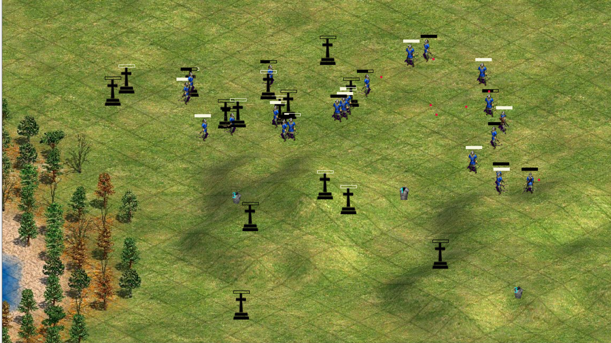
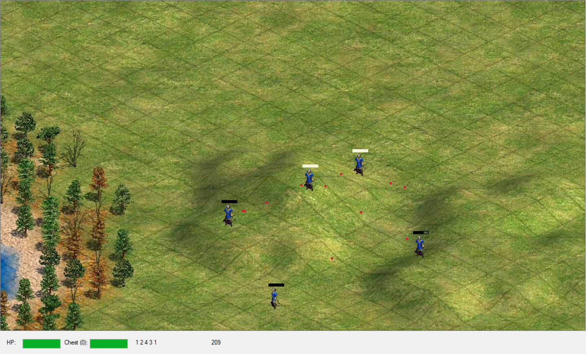

# PseudoAgeOfEmpires

## Описание

Данный проект является учебной программой, представляющей собой игру от третьего лица, где игроку отводится роль одного из стрелков в битве двух кланов: черного и белого.

Игрок имеет возможность управлять перемещением и направлением выстрела, при этом максимальная дальность выстрела ограничена. В распоряжении игрока обойма, вмещающая 4 вида патронов, каждый из
которых обладает различной скоростью, убойной силой и радиусом поражения. Каждый раз после истощения очередной обоймы необходимо произвести перезарядку, и обойма заполнится случайной последовательностью патронов.

В игре реализована система получения урона с применением дополнительной защиты в виде "брони" одного из трёх типов. В зависимости от типа броня имеет различную степень защиты и влияет на скорость перемещения юнита. Броня также имеет собственный запас прочности, который расходуется при поглощении части получаемого персонажем урона. Чем выше степень защиты брони, тем больше урона она способна поглотить за счет своего запаса прочности.

Каждый юнит имеет 100 очков здоровья, из которых при каждом попадании вычитается непоглощённый бронёй остаток урона.

Каждый две секунды на карте случайным образом появляется новый сет брони одного из доступных типов, при подборе которого броня подобравшего юнита меняется на подобранную.

Все юниты в игре равноправны, и вне зависимости от того, управляет юнитом игрок или автоматический алгоритм, все герои идентичны, так как реализованы отдельно от логики управления игровым миров и являются экземплярами одного класса.

## Игровой процесс

В начале игры на карте случайным образом располагаются 5 юнитов. Игроку предстоит как можно скорее выяснить, которым из юнитов он управляет.

Чтобы отдать подконтрольному юниту приказ на перемещение, необходимо нажать на целевую точку правой кнопкой мыши.

Чтобы отдать юниту приказ на стрельбу, необходимо нажать на целевую точку левой кнопкой мыши. В случае, если цель находится дальше максимальной дальностив выстрела, юнит автоматически направится к указанной точке.

После смерти юнита на его месте появляется надгробие. Надгробие поглощает снаряды, пролетающие через него. Как и через юнитов, через надгробия можно беспрепятственно проходить.

Чтобы подобрать предмет на карте, необходимо пройти по нему юнитом. Каждый юнит, вне зависимости от того, управляет ли им игрок или нет, способен применять все доступные на карте объекты.

Абсолютно любой выпущенный и летящий к цели снаряд, вне завивимости от того, кому он был предназначен, наносит юниту, с которым столкнется, урон, после чего исчезает из игры. Единственное исключение -- снаряды, выпущенные самим юнитом, не наносят ему урон. Friendly fire -- есть; Self fire -- нет.

## ИИ

Кроме подконтрольного игроку юнита, на карте расположено множество юнитов, управляемых алгоритмом. Каждый из юнитов принадлежит одной из двух групп. Юниты одной группы никогда целенаправленно не атакуют друг друга.

Каждый управляемый ИИ юнит выбирает случайную живую цель на карте, состоящую в вражеском клане и начинает преследовать ее, пытаясь попасть в цель выстрелом. В случае смерти цели, юнит начинает поиск другой цели. Если цель не была найдена, юнит начинает бесцельно ходить по карте.
