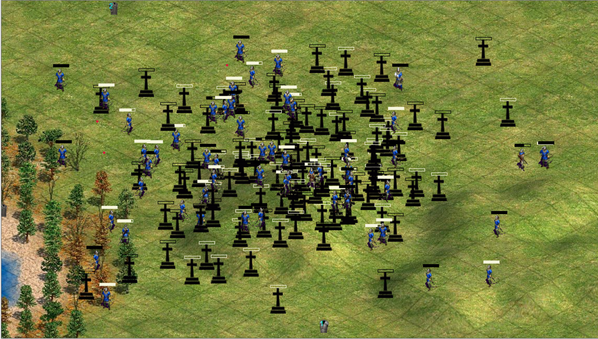

# PseudoAgeOfEmpires

## Описание

Данный проект является учебной программой, представляющей собой игру с видом сверху лица, где игроку отводится роль одного из стрелков в битве двух кланов: черного и белого.

Игрок имеет возможность управлять перемещением и направлением выстрела, при этом максимальная дальность выстрела ограничена. В распоряжении игрока обойма, вмещающая 4 вида патронов, каждый из
которых обладает различной скоростью, убойной силой и радиусом поражения. Каждый раз после истощения очередной обоймы необходимо произвести перезарядку, и обойма заполнится случайной последовательностью патронов.

В игре реализована система получения урона с применением дополнительной защиты в виде "брони" одного из трёх типов. В зависимости от типа броня имеет различную степень защиты и влияет на скорость перемещения юнита. Броня также имеет собственный запас прочности, который расходуется при поглощении части получаемого персонажем урона. Чем выше степень защиты брони, тем больше урона она способна поглотить за счет своего запаса прочности.

Каждый юнит имеет 100 очков здоровья, из которых при каждом попадании вычитается непоглощённый бронёй остаток урона.

Каждый две секунды на карте случайным образом появляется новый сет брони одного из доступных типов, при подборе которого броня подобравшего юнита меняется на подобранную.

Все юниты в игре равноправны, и вне зависимости от того, управляет юнитом игрок или автоматический алгоритм, все герои идентичны, так как реализованы отдельно от логики управления игровым миров и являются экземплярами одного класса.

## Игровой процесс

В начале игры на карте случайным образом располагаются 5 юнитов. Игроку предстоит как можно скорее выяснить, которым из юнитов он управляет.

Чтобы отдать подконтрольному юниту приказ на перемещение, необходимо нажать на целевую точку правой кнопкой мыши.

Чтобы отдать юниту приказ на стрельбу, необходимо нажать на целевую точку левой кнопкой мыши. В случае, если цель находится дальше максимальной дальностив выстрела, юнит автоматически направится к указанной точке.

Над каждым юнитом видна полоса здоровья, имеющая цвет его команды.

В засисимости от надетой на юните брони, он принимает различные текстуры, так что можно отличить на глаз более защищённых от менее защищённых.

После смерти юнита на его месте появляется надгробие. Надгробие поглощает снаряды, пролетающие через него. Как и через юнитов, через надгробия можно беспрепятственно проходить.

Чтобы подобрать предмет на карте, необходимо пройти по нему юнитом. Каждый юнит, вне зависимости от того, управляет ли им игрок или нет, способен применять все доступные на карте объекты.

Абсолютно любой выпущенный и летящий к цели снаряд, вне завивимости от того, кому он был предназначен, наносит юниту, с которым столкнется, урон, после чего исчезает из игры. Единственное исключение -- снаряды, выпущенные самим юнитом, не наносят ему урон. Friendly fire -- есть; Self fire -- нет.

## ИИ

Кроме подконтрольного игроку юнита, на карте расположено множество юнитов, управляемых алгоритмом. Каждый из юнитов принадлежит одной из двух групп. Юниты одной группы никогда целенаправленно не атакуют друг друга.

Каждый управляемый ИИ юнит выбирает случайную живую цель на карте, состоящую в вражеском клане и начинает преследовать ее, пытаясь попасть в цель выстрелом. В случае смерти цели, юнит начинает поиск другой цели. Если цель не была найдена, юнит начинает бесцельно ходить по карте.

## Больше приколов

Так как игра, строго говоря, не отводит человеку главной роли и ориентирована на равноправие игрока и компьютера, то со смертью управляемого человеком персонажа на карте просто становится
одним надгробием больше.

*Игра продолжается!*

Человек по прежнему может вмешиваться в игровой процесс, расставляя новых юнитов. Чтобы заспавнить нового воина на карте, необходимо кликнуть средней кнопкой мыши на точке карты.
Юниты черной и белой команд создаются по очереди, через одного.

Спавнить юнитов можно с самого начала игры, а не только после смерти }=)

## Что внутри?

Использованы технологии:
* .NET Framework 4.8 via C#
* WindowsForms

### Интересные проблемы и решения, которые я нашёл:

#### Случайные числа

В логике игры очень часто в циклах используются псевдослучайные числа. Так как итерация отрабатывает очень быстро, часто числа получаются одинаковыми.

Чтобы решить эту проблему, я написал статический класс RandomQueue, который содержит два независимых генератора System.Random, которые инициализированы с заведомо различными значениями Seed.
Первый генератор **__rnd_external** создается конструктором по-умолчанию, то есть его значение Seed равно времени в тиках от запуска системы (вроде бы). Второй генератор **__rnd** создается
с параметром *Seed = __rnd_external.Next(1000)*. Таким образом гарантируется, что числа, генерируемые этими генераторами с очень высокой долей вероятности раздичны.

Класс RandomQueue реализует три перегрузки метода Next(), соответствующие по поведению таковым у класса Random (полиморфизм получается).

Логика работы заключается в следующем: внутри статического класса RandomQueue запускается таймер, который каждые 20мс заполняет внутреннюю очередь Queue<int> числом, генерируемым __rnd.
По сути в классе создан некоторый пул, заполняемый случайными числами до тех пор, пока его размер не превысит значения поля класса MAX_POOL_SIZE.

По вызову метода RandomQueue.Next() генерирует число с помощью второго генератора __rnd_external, после чего сравнивает его с результатом предыдущей генерации при вызове RandomQueue.Next(). Если оказалось, что RandomQueue.Next()
два раза подряд сгенерировал одинаковые числа, то, вместо результата __rnd_external.Next(), RandomQueue.Next() возвращает число из пула Queue<int> случайных чисел.

В случае, если пул оказался пуст, возвращается число, генерируемое __rnd_external.Next()

Таким образом повышается гарантия того, что псевдослучайные числа не будут повторяться.

#### Движение юнитов, пути, коллизии

Так как архитектура и логика игры предполагают развитие событий в реальном времени, кде каждый юнит осуществляет независимые действия, необходимо было обеспечить псевдопараллельное
исполнение логики ИИ и действий игрока.

Для реализации данной идеи я решил создать три очереди псевдопараллельной обработки. Каждая очередь есть List<T>, где T -- один из специально созданных классов запросов:

* **ShootQueueTask** -- задача на выстрел снаряда в определенную точку. По сути задача для полёта снаряда к цели. Содержит ссылку на снаряд и точку назначения.
* **MovQueueTask** -- задача на перемещение игрока в определенную точку. Содержит ссылку на игрока, направление движения (нужно для отрисовки спрайта) и точку назначения.

Внутри объекта класса Game, отвечающего за взаимодйствия между юнитами, снарядами, предметами и т.д. существует таймер, который каждые 100мс вызывает метод onTimerEvent().

Внутри данного метода каждая из очередей обрабатывается независимо по следующему алгоритму в цикле for:
* Вызывается метод Movturn() соответствующего List<T> T класса задачи. Данный метод дискретно перемещает объект, и, если цель была достигнута(задача завершена), возвращает true.
* Проверяются коллизии (столкновения пули) со всеми юнитами кроме того, кто выпустил снаряд. Если пуля столкнулась с юнитом, происходит нанесение урона и задача снимается из очереди.
* Если столкновения не произошло, но задача была завершена (Movturn() вернул true), задача также снимается.

Также существует проверка на столкновение юнита и подбираемого предмета на карте:
* Для каждого юнита проверяется, соприкасается ли он с обдним из объектов
* Если коллизия есть, что предмет применяется к юниту

Очереди обрабатываются в следующем порядке:
* Снаряды
* Коллизии
* Перемещения юнитов